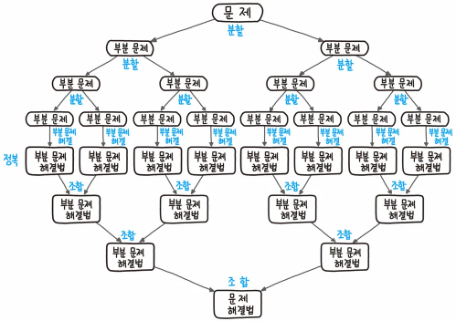

# 16th_study
16주차 스터디

# 스터디 사전 문제 
[바로가기](https://www.acmicpc.net/problem/1780)

<details>
<summary>접기/펼치기</summary>
<div markdown="1">

## [종이의 개수](https://www.acmicpc.net/problem/1780)

### [민웅](./종이의%20개수/민웅.py)
```py
# 1780_종이의개수_number-of-papers
import sys
input = sys.stdin.readline

def papercheck(n, i_idx, j_idx):
    global answer
    tmp = paper[i_idx][j_idx]

    check = True
    for i in range(i_idx, i_idx+n):
        for j in range(j_idx, j_idx+n):
            if paper[i][j] == tmp:
                continue
            else:
                papercheck(n // 3, i_idx, j_idx)
                papercheck(n // 3, i_idx, j_idx + n // 3)
                papercheck(n // 3, i_idx, j_idx + 2*(n // 3))
                papercheck(n // 3, i_idx + n // 3, j_idx)
                papercheck(n // 3, i_idx + n // 3, j_idx + n // 3)
                papercheck(n // 3, i_idx + n // 3, j_idx + 2 * (n // 3))
                papercheck(n // 3, i_idx + 2*(n // 3), j_idx)
                papercheck(n // 3, i_idx + 2*(n // 3), j_idx + n // 3)
                papercheck(n // 3, i_idx + 2*(n // 3), j_idx + 2 * (n // 3))
                check = False
                break
        if check:
            continue
        else:
            break
    else:
        if tmp == -1:
            answer[0] += 1
        elif tmp == 0:
            answer[1] += 1
        else:
            answer[2] += 1

N = int(input().strip())
paper = [list(map(int, input().split())) for _ in range(N)]

answer = [0, 0, 0]

papercheck(N, 0, 0)
print(answer[0])
print(answer[1])
print(answer[2])

```

### [상미](./종이의%20개수/상미.py)
```py
```

### [병국](./종이의%20개수/병국.py)
```py
```

### [성구](./종이의%20개수/성구.py)
```py
# 1780 종이의 개수
import sys
from collections import defaultdict
sys.setrecursionlimit(10**6)
input = sys.stdin.readline

# 1/3칸 돌리기
def devide(start_x:int, end_x:int, start_y:int, end_y:int) -> None:
    global answer
    # 1칸만 남았을 때
    if end_y - start_y <= 1:
        answer[field[start_y][start_x]] += 1
        return
    # 칸 내에 모두 같은 수 일때
    if conquer(start_x, end_x, start_y, end_y):
        answer[field[start_y][start_x]] += 1
        return
    # 중간지점 찾기
    x1_3, x2_3 = start_x+(end_x-start_x)//3, start_x+(end_x-start_x)//3*2
    y1_3, y2_3 = start_y+(end_y-start_y)//3, start_y+(end_y-start_y)//3*2
    
    # 재귀
    for sy, ey in [(start_y,y1_3),(y1_3,y2_3), (y2_3,end_y)]:
        for sx, ex in [(start_x,x1_3),(x1_3,x2_3), (x2_3,end_x)]:
            devide(sx, ex, sy, ey)

    return

# 모두 같은 수 인지 탐색
def conquer(start_x:int, end_x:int, start_y:int, end_y:int) -> int:
    tmp = field[start_y][start_x]
    for y in range(start_y, end_y):
        for x in range(start_x, end_x):
            if field[y][x] != tmp:
                return 0
            tmp = field[y][x]
    return 1


if __name__ == "__main__":
    N = int(input().strip())
    field = [list(map(int, input().split())) for _ in range(N)]
    answer = defaultdict(int)
    devide(0,N,0,N)
    for i in range(-1, 2):
        print(answer[i])
```

</div>
</details>

<br/><br/><br/>

# 알고리즘

<details>
<summary>접기/펼치기</summary>
<div markdown="1">

## 분할정복

[](https://namu.wiki/w/%EB%B6%84%ED%95%A0%20%EC%A0%95%EB%B3%B5%20%EC%95%8C%EA%B3%A0%EB%A6%AC%EC%A6%98)

### 설계
1. Divide
   - 문제가 분할이 가능한 경우, N개의 문제로 나누기
2. Conquer
   - 분할한 문제를 해결
3. Combine
   - 해결한 문제를 통합하여 본 문제를 해결

### 대표 알고리즘
1. [피보나치 수열](https://www.acmicpc.net/problem/2747)
2. 병합정렬(Merge sort)
   - [4 5 1 3 2]
3. 퀵정렬(Quick sort)

</div>
</details>

<br/><br/><br/>

# 지난 스터디 문제

<details>
<summary>접기/펼치기</summary>
<div markdown="1">

## [스마트 물류](https://softeer.ai/practice/6279)

### [민웅](./스마트분류/민웅.py)
```py
import sys
input = sys.stdin.readline

N, K = map(int, input().split())

HP = list(input().strip())
picked = [0]*N
cnt = 0

for i in range(N):
  if HP[i] == "P":
    # tmp = K
    # while True:
    #   if tmp == 0:
    #     break
    #   if i - tmp >=0:
    #     if HP[i-tmp] == "H" and not picked[i-tmp]:
    #       picked[i-tmp] = 1
    #       cnt += 1
    #       break
    #   if i + tmp <= N-1:
    #     if HP[i+tmp] == "H" and not picked[i+tmp]:
    #       picked[i+tmp] = 1
    #       cnt += 1
    #       break
    #   tmp -= 1
    for j in range(max(0, i-K), min(i+K+1, N)):
      if j != i:
        if HP[j] == "H" and not picked[j]:
          picked[j] = 1
          cnt += 1
          break

print(cnt)
          
      
```

### [상미](./스마트분류/상미.py)
```py
```

### [병국](./스마트분류/병국.py)
```py
```

### [성구](./스마트분류/성구.py)
```py
import sys
input = sys.stdin.readline

# P: 로봇, H:부품
def solution(N:int, K:int, conv:str) -> int:
  visited = [0] * N
  cnt = 0
  for i in range(N):
    if conv[i] == "H":
      for j in range(max(0, i-K), min(i+K+1, N)):
        if conv[j] == "P" and not visited[j]:
          visited[j] = 1
          cnt += 1
          break
  return cnt


if __name__ == "__main__":
  N, K = map(int, input().split())
  conv = input().strip()
  print(solution(N, K, conv))
```

## [신기한 키보드](https://www.acmicpc.net/problem/1796)

### [민웅](./신기한%20키보드/민웅.py)
```py
```

### [상미](./신기한%20키보드/상미.py)
```py
```

### [병국](./신기한%20키보드/병국.py)
```py
```

### [성구](./신기한%20키보드/성구.py)
```py
```


</div>
</details>

